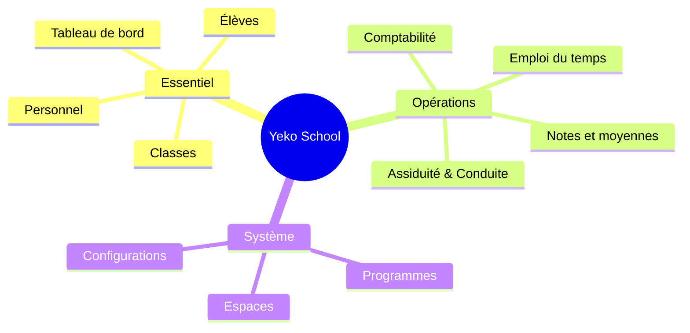

# Brainstorming : Refonte de la barre de navigation (Sidebar) Yeko School

**Animateur / Lead** : `ux-researcher` (Moi)
**Participants (Peers)** : `competitive-analyst`, `trend-analyst`, `research-analyst`

---

## 1. Analyse de l'existant (UX Researcher)

Bonjour ! J'ai analysé en détail l'état actuel de notre `sidebar.tsx` ainsi que la capture d'écran, dans le but d'identifier les sources de friction et de surcharge cognitive.

**Problèmes identifiés dans l'UX actuelle :**

1. **Duplication inutile** : "Tableau de bord", "Présence", "Notes" et "Paiements" apparaissent à la fois dans les *Raccourcis* et plus bas dans leurs catégories respectives.
2. **Surcharge d'information (Overkill)** : Des sections extrêmement lourdes. La seule section "Trésorerie > Comptabilité" abrite un menu déroulant terrifiant de 12 sous-menus.
3. **Dispersion des configurations** : La configuration est éclatée partout (ex: Configuration des bulletins, Configuration de la conduite, Setup Comptable), en plus d'une section "Configuration" globale à la fin.
4. **Profondeur excessive** : De nombreux éléments de niveau 3 qui forcent l'utilisateur à cliquer pour ouvrir, chercher, puis cliquer à nouveau.

J'ai réuni nos trois meilleurs analystes pour disrupter cette approche.

---

## 2. Perspectives des experts

### 🕵️‍♂️ `competitive-analyst` (Analyse concurrentielle)
>
> *« J'ai audité les SaaS B2B modernes (les nouveaux standards ERP et plateformes éducatives). La norme aujourd'hui n'est plus au "tout-dans-le-menu". On observe une séparation stricte entre les **Opérations Quotidiennes** (qui restent dans la barre latérale) et les **Paramétrages Moteurs** (qui vont dans une section dédiée ou un menu "Settings" séparé). Éparpiller les paramètres dans chaque module alourdit considérablement l'interface. »*

### 📈 `trend-analyst` (Tendances & UI)
>
> *« Les "Méga-Sidebars" monolithiques sont "out". L'expérience utilisateur moderne privilégie les structures aplaties (hybridation entre Primary Nav et Sub-Nav de page). De plus, si l'on veut vraiment des sous-menus profonds comme pour la "Comptabilité", la tendance est de regrouper l'essentiel et de déléguer les vues complexes au sein d'un "Secondary Menu" (ex: des onglets (Tabs) internes dans la page de paiement) ou via une **Command Palette (Ctrl+K)**. Moins de bruit visuel = plus de focus. »*

### 🧠 `research-analyst` (Ergonomie & Charge cognitive)
>
> *« En m'appuyant sur la loi de Miller (mémoire de travail limitée à 7 éléments), l'interface actuelle génère une fatigue décisionnelle (Hick's Law). L'architecture actuelle est **"Data-Centric"** (basée sur les tables de la base de données). Nous devons pivoter vers une approche **"User-Centric"** et **"Task-Centric"** (les tâches quotidiennes du directeur). Les raccourcis codés en dur n'aident pas s'ils font doublon ; ils devraient être soit dynamiques (basés sur l'usage), soit supprimés au profit d'une navigation globale claire et prédictible. »*

---

## 3. Analyse de l'ancienne version (Navigation Plate / Flat Nav)

Vous avez mentionné une ancienne version de la barre ("Élèves", "Classes", "Comptabilité", etc., sans menus déroulants et avec tous les paramètres sous "Configurations"). Voici ce qu'en disent nos experts à la lumière des standards UX actuels et de nos recherches récentes :

### 🕵️‍♂️ `competitive-analyst` (Le retour du "Flat")

> *« Sur le marché SaaS B2B, on constate un retour de balancier. Les structures profondes (Nested Menus) cachent l'information et ralentissent l'utilisateur. Le modèle "Flat" de votre ancienne version est en réalité très proche des standards d'aujourd'hui (comme Github, Linear ou Vercel qui utilisent des Sidebars de premier niveau simples puis une navigation secondaire par onglets sur la page). Avoir un onglet "Configurations" unique global est une excellente pratique qui sépare les opérations système des tâches métier. »*

### 📈 `trend-analyst` (Efficacité vs Richesse)

> *« L'ancienne sidebar brille par sa **scannabilité**. En un coup d'œil, l'utilisateur dresse la carte mentale de l'application. Les menus "Collapsables" ou accordéons que vous avez ajoutés depuis ont voulu absorber la complexité grandissante de Yeko, mais au détriment de l'intuitivité. Le design monolithique "sans sous-menu" force les designers à prendre de meilleures décisions de produit en regroupant les vues connexes à l'intérieur de la page principale (au lieu de créer un nouveau niveau de menu). »*

### 🧠 `research-analyst` (Pourquoi c'était mieux)

> *« L'ancienne version respectait sans le savoir le principe du "Progressive Disclosure" (divulgation progressive). L'utilisateur cliquait sur "Comptabilité" (niveau 1 de la sidebar) puis découvrait les options "Taxes", "Plan de paiement" au centre de l'écran ou via une navigation secondaire. C'est le flux parfait. La douleur actuelle vient d'avoir exporté cette structure secondaire de la page **vers la sidebar principale**, transformant celle-ci en un "monstre de Franckestein" cognitif cliquable 12 fois. »*

**Conclusion sur l'ancienne version :** L'approche était la bonne, mais a probablement été abandonnée parce que l'application a grossi. La solution n'est pas d'imbriquer les menus, mais d'**hybrider la vieille méthode Flat avec une vraie navigation par onglets (Tabs) sur les pages.**

---

## 4. Proposition de Nouvelle Architecture (UX Researcher)

En synthétisant ces retours, je propose une nouvelle architecture d'information (IA) beaucoup plus intuitive qui **rend hommage à votre ancienne version**.

**Principes de la refonte :**

1. **Zéro doublon** : Suppression de la section "Raccourcis" (le tableau de bord devient le point d'entrée naturel par défaut).
2. **Regroupement par Intention** : Fusion des concepts qui vont ensemble.
3. **Centralisation de la Configuration** : Tous les réglages (Bulletins, Finance, Conduite) sont déplacés ensemble, allégeant la navigation courante.

### Architecture Simplifiée (Format YAML)

```yaml
navigation:
  - section: "Essentiel"
    items:
      - title: "Tableau de bord"
        icon: "IconLayoutDashboard"
      - title: "Élèves"
        icon: "IconSchool"
      - title: "Classes"
        icon: "IconLayoutGrid"
      - title: "Personnel"
        icon: "IconUsers"

  - section: "Opérations"
    items:
      - title: "Emploi du temps"
        icon: "IconCalendar"
      - title: "Assiduité & Conduite"
        icon: "IconUserCheck"
      - title: "Notes et moyennes"
        icon: "IconClipboardCheck"
      - title: "Comptabilité"
        icon: "IconCurrencyDollar"

  - section: "Système"
    items:
      - title: "Programmes"
        icon: "IconBook"
      - title: "Espaces"
        icon: "IconBuilding"
      - title: "Configurations"
        icon: "IconSettings"
```

### Visualisation du Flux (Mermaid)



## 5. Validation technique (Analyse du Workspace `apps/school`)

Suite à une analyse complète du routage (dossier `apps/school/src/routes/_auth`), nous constatons que l'architecture des fichiers valide parfaitement ce modèle "Flat". L'application est structurellement découpée en **11 modules métier principaux** qui correspondent exactement aux éléments de navigation du premier niveau de la Sidebar simplifiée :

1. `dashboard.tsx` -> **Tableau de bord**
2. `students` -> **Élèves**
3. `classes` & `programs` -> **Classes & Programmes**
4. `users` -> **Professeurs / Communauté**
5. `schedules.tsx` -> **Emploi du temps**
6. `conducts` -> **Assiduité & Conduite**
7. `grades` -> **Notes et moyennes**
8. `accounting` -> **Comptabilité** (Contient 13 fichiers qui seront gérés par onglets)
9. `spaces` -> **Espaces**
10. `settings` -> **Configurations globales** (Où seront rapatriés `conducts/settings`, `accounting/setup`, etc.)

L'adoption de la "Flat Navigation" ne sera donc pas un "hack" visuel, mais un reflet honnête et direct de l'architecture technique sous-jacente des dossiers `src/routes`.

## 6. Structure des Sous-vues (Navigation par Onglets / Tabs)

Puisque la Sidebar n'affichera que les menus principaux, chaque module lourd utilisera une navigation secondaire à l'horizontale en haut de page (Tabs). Voici comment les fichiers actuels du routage se répartissent dans ces onglets :

### Essentiel

- **Tableau de bord** : Vue unique (Pas d'onglets).
- **Élèves** : Liste unique des élèves (avec boutons actions, Import/Export, filtre).
  - *La navigation par onglets (Profil | Présence | Performance | Parents | Inscriptions) sera réservée à la **Vue Détail** lorsqu'on clique sur un élève spécifique.*
- **Classes** : Liste unique des classes (avec boutons actions, Import/Export, sélection multiple).
  - *La **Vue Détail** d'une classe affichera ses KPIs (Total élèves, Moyenne générale, Assiduité, Performance) au-dessus de la liste de ses élèves.*
- **Personnel (Communauté)** : Liste unique de l'équipe (Professeurs & Staff).
  - *Actions* : Créer (Manuel), Inviter (Email), Import/Export, Sélection multiple.
  - *Filtrage* : Filtre par rôle (défaut : "Professeurs").
  - *Affichage Dynamique* :
    - **Tous** : Nom, Email, Poste, Département, Statut, Date d'embauche.
    - **Professeurs uniquement (Colonnes en +)** : Classes affectées (compteur), Responsabilité Prof Principal, Ponctualité.
  - *Vue Détail* :
    - **Staff** : Informations perso, Activités.
    - **Professeurs** : + Graphique Ponctualité, Liste des classes (et statut principal ou non).

### Opérations

- **Emploi du temps** : Grille principale avec 3 onglets (Classe | Enseignant | Salle).
  - *Optimisation UX* :
    - **Suppression du sélecteur d'année scolaire** : Il fait doublon avec celui déjà présent dans le header global.
    - **Sélecteur contextuel** : Afficher un sélecteur de "Classe", d' "Enseignant" ou de "Salle" selon l'onglet actif.
    - **Correction (Salle)** : S'assurer que le sélecteur de salle est bien visible et fonctionnel dans l'onglet "Salle".
- **Assiduité & Conduite** : Gestion unifiée avec 2 onglets principaux (Élèves | Professeurs) et gestion des signalements.
  - *Vue Élèves* (Basée sur les maquettes `conduct` & `student-attendance`) :
    - **KPIs (Haut de page)** : Population, Performance moyenne (/20), Nombre d'Incidents, Taux d'Excellence.
    - **Graphique de Répartition** : Distribution des notes de conduite par catégorie.
    - **Table de Conduite (Colonnes)** : # | Élève (Photo/Nom) | Classe | Note /20 | Appréciation | Détails | Assiduité | Incidents | Actions.
    - **Actions Contextuelles** : Le bouton (+) ouvre la modale "Signaler un Incident de Conduite" (`alerts`).
  - *Vue Professeurs* (Imagination par symétrie, basée sur `teacher-attendance`) :
    - **KPIs (Haut de page)** : Effectif Enseignants, Taux de Présence Global, Retards Cumulés, Indice de Ponctualité.
    - **Graphique de Répartition** : Distribution de la "Fiabilité" des enseignants.
    - **Table de Suivi (Colonnes)** : # | Enseignant | Matières | Classes | Taux de Présence | Retards | Note Ponctualité | État actuel | Actions.
- **Notes et moyennes** : Gestion complète orchestrée autour de 4 onglets : Bulletins | Saisie | Validations | Statistiques.
  - *Comportement* : L'onglet "Bulletins scolaires" (`report-cards.tsx`) est la vue principale par défaut.
  - *Vue Bulletins scolaires* :
    - **Titre** : Bulletins & Résultats Scolaires.
    - **Actions (Boutons)** : "Exporter toutes les notes", "Télécharger Bulletins".
    - **Contenu** : Moyennes globales, classement, taux de réussite et accès rapide au détail des notes par élève.
  - *Vue Saisie des notes* (`entry.tsx`) : Grille tabulaire pour l'entrée des notes.
  - *Vues Validations & Statistiques* (`validations.tsx`, `statistics.tsx`) : Onglets secondaires dédiés au flux d'approbation des notes et à l'analyse de performance.
- **Comptabilité** : Gestion financière unifiée par onglets. La complexité des 12 anciens sous-menus est résolue en séparant strictement l'opérationnel du paramétrage.
  - *Opérationnel (Onglets de la page)* :
    - **Aperçu / Tableau de bord** (`dashboard.tsx`) : Vue principale (KPIs : Chiffre attendu, Recouvrement, Impayés). Tableau de suivi du "Statut de paiement" par élève. Actions rapides en haut ("Nouveau Paiement", "Envoyer un Rappel").
    - **Transactions** (`payments.tsx`, `refunds.tsx`) : Historique complet et filtrable de tous les paiements et remboursements.
    - **Frais & Échéanciers** (`student-fees.tsx`, `payment-plans.tsx`) : Suivi des facturations assignées aux élèves et gestion de leurs plans de paiement personnels.
    - **Catalogue Tarifaire** (`fee-types.tsx`, `fee-structures.tsx`, `discounts.tsx`, `payment-plan-templates.tsx`) : Référentiel des grilles de frais, réductions et modèles d'échéanciers de l'école.
  - *Migration pure* : Les éléments purement structurels (`accounts.tsx`, `fiscal-years.tsx`, `setup.tsx`) quitteront cette vue pour rejoindre les "Configurations" globales.

### Système

- **Programmes** : Gestion académique par onglets.
  - *Comportement* : L'onglet "Avancement" (Suivi Pédagogique) est la vue principale par défaut.
  - *Vue Avancement* (`curriculum-progress.tsx`) : Permet au Directeur de suivre en temps réel la progression des leçons (Tableau : Niveau, Matière, Ordre, Leçon, Progression, Statut, Dates).
  - *Vues Matières & Coefficients* (`subjects.tsx`, `coefficients.tsx`) : Tabs secondaires conservant l'UI/UX de paramétrage des cours.
- **Espaces** : 2 Onglets - Salles de classe (`classrooms/`) et Disponibilités (`availability.tsx`).
- **Configurations** : Hub centralisé regroupant tous les paramétrages du système sous forme d'onglets (Tabs). Résout le problème historique de la "dispersion des réglages".
  - *Profil de l'École* (`profile.tsx`) : Informations générales, Contacts, Logo, et aperçu des statistiques rapides.
  - *Années Scolaires* (`school-years.tsx`) : Gestion des années académiques et définition de l'année courante/par défaut.
  - *Pédagogie & Bulletins* (`pedagogical-structure.tsx`, `report-cards.tsx`) : Structure pédagogique (Cycles, Niveaux), Modèles de bulletins, Échelle de notation et seuils de validation.
  - *Assiduité & Conduite* (Migré depuis `conducts/settings.tsx`) : Paramétrage des règles de conduite, types d'incidents, et barèmes de sanctions/points.
  - *Comptabilité & Finances* (Migré depuis `accounting/`) : Configuration transactionnelle (`setup.tsx`), Plan comptable (`accounts.tsx`), et Années fiscales (`fiscal-years.tsx`).
  - *Système & Notifications* (`notifications.tsx`) : Préférences globales et gestion des automatisations/modèles de communication.

---

## 7. Recommandations et Prochaines Étapes

Afin d'implémenter cela concrètement dans le fichier `sidebar.tsx` :

1. **Supprimer le bloc `shortcuts`** du code : La navigation de base deviendra si simple que ce système d'ancrage ne sera plus justifié.
2. **Éliminer les enfants (`children/Collapsables`)** : Transformer les éléments actuels en menu "Flat" de premier niveau de 10-12 éléments.
3. **Regrouper les paramètres** : Déplacer tous les liens de configuration vers un hub "Configurations" et la gestion physique vers "Espaces".
4. **Adopter un système de navigation secondaire par onglets (Tabs)** : Puisque nous supprimons la profondeur de la Sidebar, les pages complexes (comme *Finances* ou *Notes*) accueilleront des Tabs en haut de page pour naviguer vers les sous-vues.

> 🛠️ **Note Qualité & Déploiement :**
> Lors de la suppression des dossiers imbriqués et la consolidation en vue par onglets, veillez à auditer les différents fichiers `index.tsx` de chaque dossier (ex: `apps/school/src/routes/_auth/grades/index.tsx`) afin de vous assurer qu'ils redirigent correctement vers l'onglet défini "par défaut" (ex: Bulletins pour les notes, ou Avancement pour les programmes), ou convertissez ces composants "Index" pour héberger la coquille des Layouts Tabaired.
